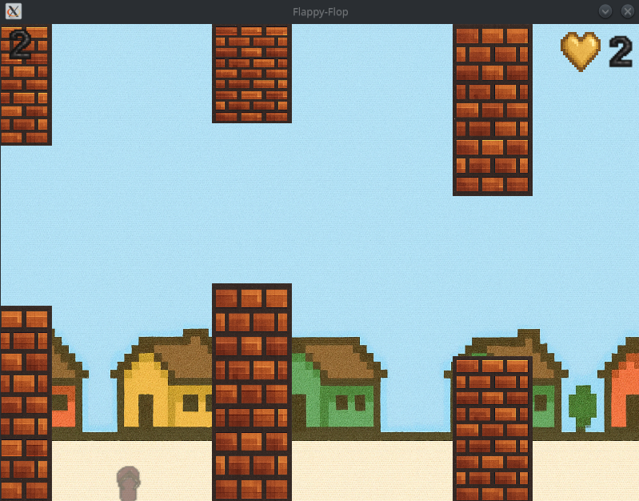
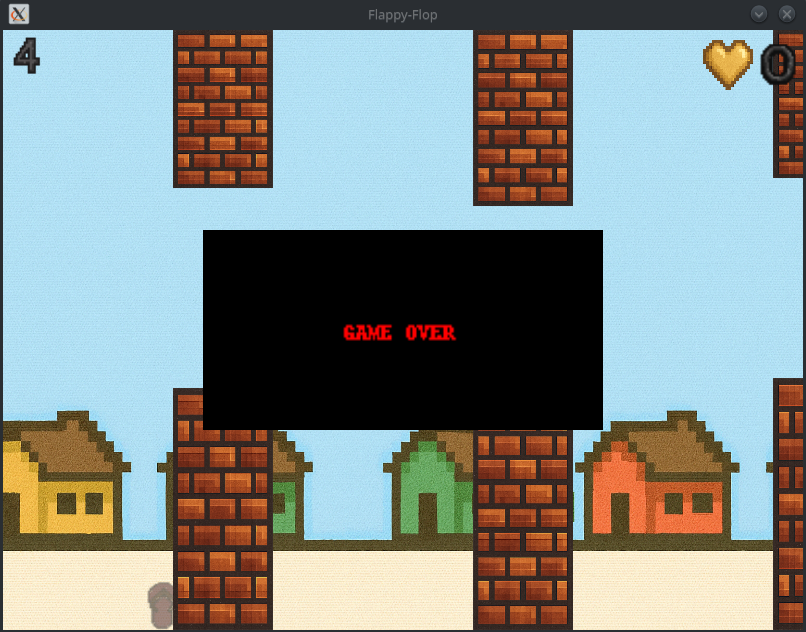

# Flappy-flop

Jogo inspirado no Flappy Bird, controle um chinelo voando entre muros.

- Python
- PyOpenGL
- GLFW
- Pillow

## Como jogar
- Pressione espaço para fazer o chinelo subir
- Evite colidir nos muros
- Cada obstáculo ultrapassado soma um ponto
- Pressione ESC para finalizar o jogo

## Telas

